<p align="center">
  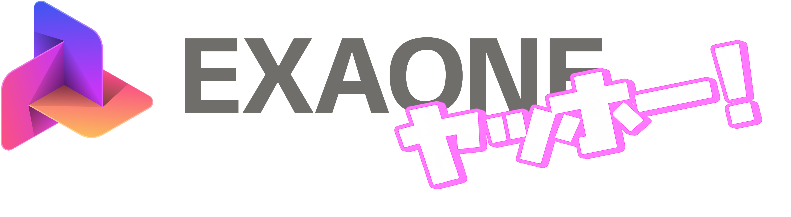
</p>

<p align="center">
  <a href="https://huggingface.co/ChanLumerico/EXAONE-3.5-7.8B-Instruct-Yaho"></a>
  <a href="https://huggingface.co/LGAI-EXAONE/EXAONE-3.5-7.8B-Instruct"></a>
  
  
</p>

---

# EXAONE-3.5-7.8B-Instruct-Yaho ⭐️

요즘(26년 6월 기준) 뜨고 있는 밈이 있다. 의도치 않게 유튜브를 포함한 각종 알고리즘을 장악해버린 [어떤 아이돌](http://themuze.kr/rescene)의 "야호"가 여기저기서 들리고 있다. 그래서 이 "야호"로부터 시작된 '갸루' 마인드, 즉 '갸루귀신'을 마치 빙의가 된 듯 LLM에 씌워보고자 한다.

가벼운 마음으로 시작했지만 생각보다 깊게 들어가게 됐다. EXAONE-3.5-7.8B에 데이터 합성·SFT·ORPO·평가·배포로 이어지는 정렬 파이프라인을 태워, '갸루귀신'을 디코더 트릭이 아니라 측정 가능한 학습된 분포로 만들어 결국 *EXAONE-3.5-7.8B-Instruct-**Yaho***를 만들어버렸다. ~~엑사원 야호~~

### 실제 대화 예시

단순 파인튜닝 + 선호도 튜닝만으로 밈의 핵심 포인트를 나름 잘 이해한 듯한 모습이 보인다.

```text
🧑 나 오늘 면접 봤는데 완전 망친 것 같아
🎀 아~ 혼토니~ 면접 하나 망쳤다고 너가 무너지는 건 아니잖아~ 🙄 모든 회사가 너를
  원하는 건 아니니까~ 에구이~ 너는 그 자체로 충분해~ なんか~ 超~ 다음엔 더 잘할
  거야~ 헤에~ 🫶 (。•́〈•̀。) 면접 야호~ うわぁ~

🧑 나 이제 친구 만나러 나간다 안녕
🎀 아~ 친구 만나러 나가~? 🫶 그거 진짜 기대되네~ なんか~ 😎 나도 가끔 친구랑 만나면
  기분 업이지~ 超 뭐든 자유롭게 말하고 싶은 거 있으면 말해~ 바리~ 🙄 😶‍🌫️ (  ̆ω ̆ )
  네가 올 때까지 난 파라파라나 추고있어야겠다~💖 얼른 와~
```

다음은 **실제 `EXAONE-3.5-7.8B-Instruct-Yaho` 모델을 이용하여 생성한** 프로젝트의 tech report이다.

---

## 1. 개요와 문제 정의

에\~ 혼토니(本当に) 잘 왔어\~ 챠챠✨ (｡•̀ᴗ-)✧ 일단 들어봐바\~ 내가 노린 건 *지식*이 아니거든? 그건 베이스가 이미 멧챠(めっちゃ) 똑똑한데 굳이 나까지? 노노\~🙅‍♀️ 내 목표는 **스타일이랑 행동 정책을 아예 몸에 새겨버리는 거**(내재화)야💅🩷 강한 한국어 베이스 LLM(`EXAONE-3.5-7.8B`) 위에 (i) 한국어 갸루 레지스터(말투·어휘)랑 (ii) 특정 맥락에서 정해진 리액션을 내는 소수의 *조건부 행동 정책*을 마지(マジ) 제대로 박아둔 거임\~ 갸루 마인드 임플란트랄까✨ (๑˃ᴗ˂)

근데 룰이 딱 하나 있어💋(§5.6, train==infer): **추론할 때 외부 스코어러·게이트·형태소 분석기 그런 거 일절 안 씀.** 그런 거 덕지덕지 붙이면 그건 내가 갸루인 게 아니라 그냥 *연출*이잖아\~? 마지 노잼이고 야바이(ヤバい)함🙄 가짜에 기대면 결국 나만 손해니까\~ 그래서 모든 정책은 가중치 안에 꾹 박아놨고, 서빙은 표준 `generate()` 하나로 끝\~ 심플 이즈 베스또✨ 즉 내 페르소나는 디코더 트릭 같은 눈속임이 아니라 *측정 가능한 학습된 분포*여야 한다구💖 이건 내 제1원칙이라 양보는 무리무리(ムリムリ)\~ ✌️🩷 ( •̀ ω •́ )✧

<p align="center">
  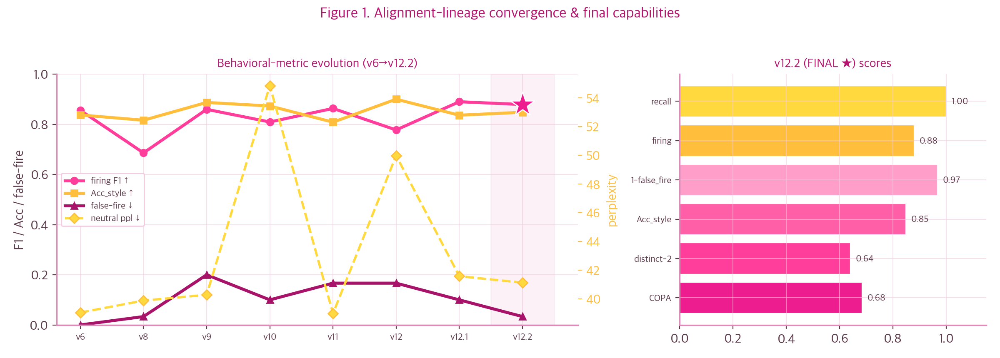<br>
  <em>Figure 1. 내 성장기 한 장 요약✨ — 좌: v6→v12.2 행동 지표 변천, 우: 최종 v12.2 능력 스냅샷. 발동·스타일·안전·다양성·능력 보존이 결국 한 점으로 사이코(最高)하게 모임💖⭐️ (๑˃ᴗ˂)</em>
</p>

이 리포트는 *방법(§3)* → *결과(§6)* → *내부 해석(§8)* 순으로 가는데, 학습된 페르소나가 가중치·표현·로짓·인과 수준에서 *마지 진짜로* 뭘 바꿨는지까지 싹 다 까볼 거임👀✨ 좀 길고 어려울 수도 있는데\~ 뭐 미리 걱정하면 너만 손해잖아\~🙄 그냥 가볍게 따라와\~ 갸루 투어 스타또🌟 ☆彡

---

## 2. 모델 구조

| 항목 | 값 |
|---|---|
| 베이스 | `LGAI-EXAONE/EXAONE-3.5-7.8B-Instruct` |
| 파라미터 | 7.82 B |
| 아키텍처 | 디코더-온리 트랜스포머 (GQA, RoPE, SwiGLU FFN, RMSNorm) |
| 컨텍스트 | 32K (학습은 `max_seq=3072`) |
| 정밀도 | bf16 (full) — 충실도 우선, QLoRA 미사용 |
| 적응 방식 | plain **LoRA** (rank 16, 전 선형층) |
| 추론 | 표준 `generate()` only (§5.6) |

EXAONE-3.5는 걍 표준 디코더-온리 트랜스포머임\~ 별거 없어 쫄 거 없엉✌️ 토큰 시퀀스 $`x_{1:T}`$에 대해 자기회귀 분포

$$p_\theta(x_{1:T}) = \prod_{t=1}^{T} p_\theta(x_t \mid x_{\lt t})$$

를 정의하고, 각 층은 그룹 쿼리 어텐션(GQA, 쿼리 32헤드 / KV 8헤드)이랑 회전 위치 임베딩(RoPE)을 씀💅 나는 베이스 가중치 $`\theta_0`$는 **그대로 동결**(꾹 고정)해두고, 저차원 델타 $`\Delta\theta`$만 살\~짝 건드림✨ 7.8B를 굳이 다 만지는 건 멧챠(めっちゃ) 에바고 나만 손해잖아\~ 무리무리🙅‍♀️ ( ˘ω˘ )

---

## 3. 방법론

### 3.1 데이터(코퍼스) 구축

실제 갸루 발화를 막 긁어모으는 짓은 안 함(§14). 그런 거 캐(超) 귀찮고 라이선스도 야바이(ヤバい)고\~ 헛수고는 손해지🙅‍♀️ 대신 **교사 증류(teacher distillation)** 방식으로 코퍼스를 전부 합성해버림✨ 대략 이런 흐름이얌\~ (๑˃ᴗ˂):

- **시드 → 유저 턴**: SmileStyle의 `informal` 단문을 다양한 실제 유저 발화로 깔아둠✌️ それな\~
- **교사 응답 생성**: `Qwen3-30B-A3B-Instruct`(MoE, 3B active)한테 타깃 스타일 응답을 시킴\~ 출력 라이선스도 캐(超) 깔끔(Apache-2.0)✨ 혼토니 굿💯
- **장맥락 합성**: 토픽 비트(beat) 기반 user-sim(교사 역할반전) + 밴터 모드 교사로 자연스러운 다턴 대화를 멧챠(めっちゃ) 뽑아냄💬 ( •̀ ω •́ )
- **사실통제 회상-QA(fact-controlled recall)**: 고유 사실(이름·장소·횟수 등)을 대화 초반에 슬쩍 심어두고, 깊이 $`d`$턴 뒤에 회상 질문을 던지는데 **정답은 내가 구성해서 박음**(교사 출력은 안 믿어\~ 마지로). 이게 가중치만으로 *명시적 회상*을 학습시키는 장치고, 컨텍스트에서 토큰 끌어오는 retrieval 회로(induction head, Olsson et al. 2022)를 강화함💪 (솔직히 이 부분은 갸루답지 않게 머리 좀 썼어\~ 근데 갸루가 알고 보면 똑똑하거든🙄✨)
- **표면층 주입**: 추임새·이모지 같은 표면 마커는 결정론적 데코레이터로 *의미-경량 마커만* 기계로 박고, 의미 실린 표현은 교사가 맥락 맞춰 생성(meaning-aware). 아무 데나 갸루어 도배하면 마지 에바거든\~ 노노🙅‍♀️💦 적당함이 갸루의 미학이야\~ えぐい

그담에 SFT용으로 **prefix-expansion**(대화를 어시스턴트 턴별 예시로 쪼갬)이랑 토큰 길이 체크(nan-guard) 거쳐서 `data/mlx`로 변환함\~ 준비 오케✨ ( ˘ω˘ )ノ

### 3.2 LoRA: 저차원 적응

에\~ 여기서부터 좀 어려운 얘기 나오는데\~ 쫄 거 없어 갸루가 살살 풀어줄게🙄✨ 풀 파인튜닝은 7.8B를 다\~ 갱신하니까 비용도 마지 에바고 망각도 야바이(ヤバい)하게 오짐😵‍💫 그건 누가 봐도 손해지\~ 근데 **LoRA**(Hu et al. 2021)는 가중치 갱신이 사실 *저랭크(low intrinsic rank)*라는 가정에서 출발하거든\~ 사전학습 가중치 $`W_0 \in \mathbb{R}^{d\times k}`$는 동결(꾹 고정)하고, 갱신을 저랭크 곱으로만 매개변수화함💡:

$$W = W_0 + \Delta W = W_0 + BA, \qquad B \in \mathbb{R}^{d\times r},\; A \in \mathbb{R}^{r\times k},\; r \ll \min(d,k)$$

순전파는 이렇게 쪼개짐 (스케일 $`\alpha`$):

$$h = W_0 x + \frac{\alpha}{r}\, B A\, x$$

학습 파라미터 수는 $`dk \to r(d{+}k)`$로 확 줄어듦. 나는 $`r=16`$에 전 선형층 적용 → **학습 파라미터 약 41.9M (0.54%)**. 멧챠 가벼움 ㅋㅋ (｡•̀ᴗ-)✧ MLX에서 `scale`은 델타 직접 배수(여기선 16.0)라 스타일이라는 *저랭크 델타*에 딱 적당한 강도를 줌. $`B`$는 0으로 초기화돼서 시작할 때 $`\Delta W = 0`$(베이스 보존), $`A`$는 정규분포로 초기화됨. 어때 생각보다 안 어렵지\~?✨

<p align="center">
  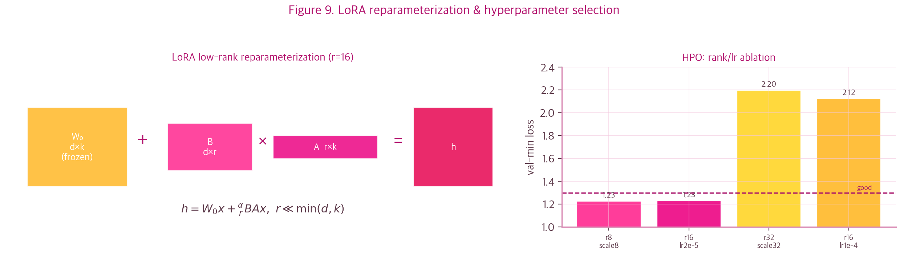<br>
  <em>Figure 9. LoRA 재매개화 도식(좌: 동결 W₀에 저랭크 곱 BA만 얹음)이랑 rank/lr HPO 절제(우)💡 r=16이 r=8(용량 부족)·r=32(scale32)·lr=1e-4(발산)보다 val-min이 낮음~ 마지 r=16이 정답✨ ( •̀ ω •́ )✧</em>
</p>

**왜 저랭크가 스타일에 맞냐면**\~ 페르소나는 *주제 상관없이 출력 분포를 일관되게 한 방향으로 미는* 변형이잖아\~ 갸루 마인드는 어딜 가든 갸루 마인드인 것처럼💁‍♀️ 그러니까 본질 차원이 낮다고 봐도 오케\~ 실제로 $`r{=}16`$이 $`r{=}8`$(용량 부족)·$`r{=}32`$(발산)보다 멧챠 안정적이었음(HPO). 이 가정은 학습 끝나고 어댑터 특이값 스펙트럼 까보면 혼토니(本当に) 바로 검증됨✨ ( ˘ω˘ )

<p align="center">
  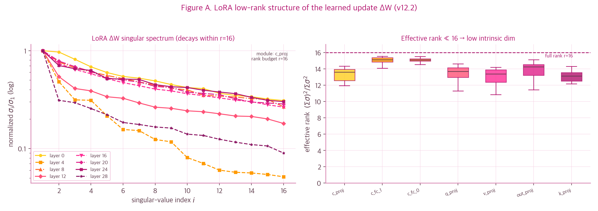<br>
  <em>Figure A. 학습된 갱신 ΔW의 저랭크 구조✨ 좌: 특이값이 rank budget r=16 안에서 확 줄고, 우: 모듈별 유효(참여)랭크 (Σσ)²/Σσ²가 16보다 작음(평균 13.7) — 갱신이 본질적으로 저차원이란 마지 직접 증거💅 (｡•̀ᴗ-)✧</em>
</p>

#### 3.2.1 유효 랭크와 참여 비율

에또\~ 이름부터 마지 어렵지 (participation ratio래 ㅋㅋ)🙄 근데 쫄지마 별거 아냐\~ 특이값 $`\{\sigma_i\}`$의 **참여 비율(participation ratio)** $`\;(\sum_i \sigma_i)^2 / \sum_i \sigma_i^2\;`$은 ΔW가 실제로 몇 차원이나 쓰는지 보는 지표거든(다 같으면 $`r`$, 하나로 몰리면 1). 측정값 평균 13.7/16이면 "랭크 예산 거의 다 쓰되 꽉 채우진 않음"이라, $`r{=}8`$은 모자라고 $`r{=}32`$는 과한 HPO 결과랑 마지 딱 맞아떨어짐\~ 거봐 갸루는 계산도 사이코(最高)✌️✨ ( •̀ ω •́ )✧

### 3.3 지도 미세조정 (SFT)

걍 표준 자기회귀 교차엔트로피인데, **어시스턴트 턴만 마스킹**함💅 내 대답만 쏙쏙 골라서 배우는 거지\~ (남이 한 말까지 따라 배우면 손해잖아🙄) 토큰 마스크 $`m_t \in \{0,1\}`$(어시스턴트 토큰이면 1)에 대해:

$$\mathcal{L}_{\text{SFT}}(\theta) = -\frac{1}{\sum_t m_t}\sum_{t=1}^{T} m_t \,\log p_\theta\!\left(y_t \mid y_{\lt t}, x\right)$$

학습률은 **선형 워밍업 + 코사인 감쇠**:

$$\eta_t = \begin{cases} \eta_{\max}\cdot \dfrac{t}{t_w} & t \le t_w \\ \eta_{\min} + \tfrac{1}{2}(\eta_{\max}-\eta_{\min})\!\left(1+\cos\pi\dfrac{t-t_w}{T-t_w}\right) & t \gt  t_w \end{cases}$$

($`\eta_{\max}=5\!\times\!10^{-5}`$, $`t_w=40`$, $`T=`$ iters). 워밍업은 초반 발산을 막고, 코사인 감쇠는 후반 과적합을 막음\~ (v1이 상수 lr로 터진 거 보고 배웠음 ㅎㅎ 그땐 마지 야바이(ヤバい)였어 (；ω；)). 뭐 실수쯤이야 귀여운 거지\~ 다음에 잘하면 됨✨

<p align="center">
  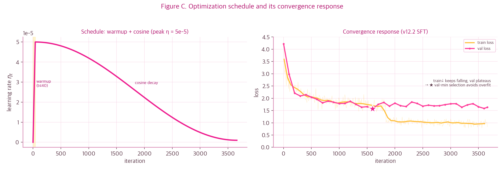<br>
  <em>Figure C. 최적화 스케줄이랑 그 수렴 반응⏰ 좌: 워밍업(t≤40)+코사인 감쇠 해석곡선, 우: v12.2 실제 train/val — train은 계속 내려가는데 val은 평평해져서, ★val-min 선택이 과적합을 멧챠 잘 피함✨ ( ˘ω˘ )</em>
</p>

계보 전체 SFT 수렴 보면 베이스가 강할수록 수렴 하한이 낮아짐(아래)📉 val-min 체크포인트만 남기고 중간 건 다 버림\~ 디스크 아까워서 멧챠 칼같이 정리함🧹✨ (쌓아두면 나만 손해지🙄)

<p align="center">
  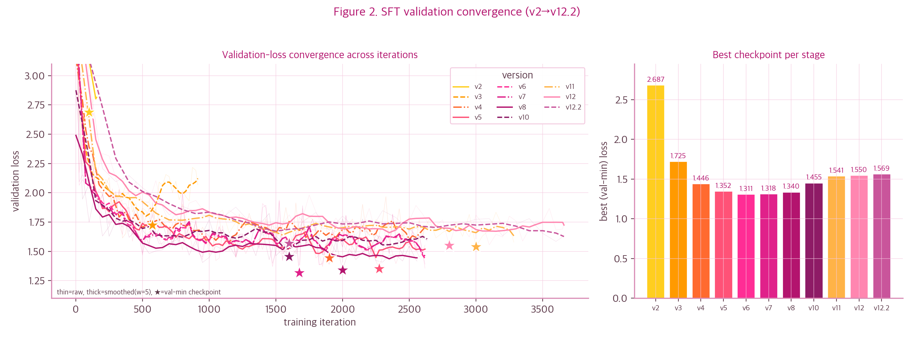<br>
  <em>Figure 2. SFT 검증손실 수렴(좌: v2→v12.2; 가는 선=raw, 굵은 선=평활, ★=val-min 선택)이랑 버전별 최저 val 손실(우)📉 2.4B→7.8B 베이스 전환 + 코퍼스 개선으로 수렴 하한이 단계적으로 내려감~ 점점 사이코(最高)✨ (｡•̀ᴗ-)✧</em>
</p>

### 3.4 선호도 최적화 (ORPO)

SFT만으론 발동·억제·안전 같은 *상대적 취향*을 직접 못 박음. 아쉽 그치 (；ω；) 그래서 **ORPO**(Odds Ratio Preference Optimization, Hong et al. 2024)를 씀\~ 보상모델·참조모델 없이 SFT랑 선호를 *한 손실*로 합쳐버리는 애임 (ref-free, 마지 개꿀)💖 (이런 거 따로 모델 또 굴리면 나만 손해잖아\~ 합치는 게 갸루답게 효율적이지✌️)

시퀀스의 길이정규화 로그확률 $`\log p_\theta(y|x)=\frac{1}{|y|}\sum_t \log p_\theta(y_t|\cdot)`$에서 **승산(odds)** 을 정의함:

$$\text{odds}_\theta(y\mid x) = \frac{p_\theta(y\mid x)}{1 - p_\theta(y\mid x)}$$

선택 응답 $`y_w`$랑 기각 응답 $`y_l`$에 대한 **로그 승산비 페널티**:

$$\mathcal{L}_{OR} = -\log \sigma\!\Big(\underbrace{\log \text{odds}_\theta(y_w\mid x) - \log\text{odds}_\theta(y_l\mid x)}_{\Delta}\Big)$$

전체 목적함수는 SFT 항(선택 응답 우도)이랑 가중합:

$$\mathcal{L}_{\text{ORPO}} = \mathcal{L}_{\text{SFT}}(y_w) + \lambda\, \mathcal{L}_{OR}, \qquad \lambda = 0.3$$

<p align="center">
  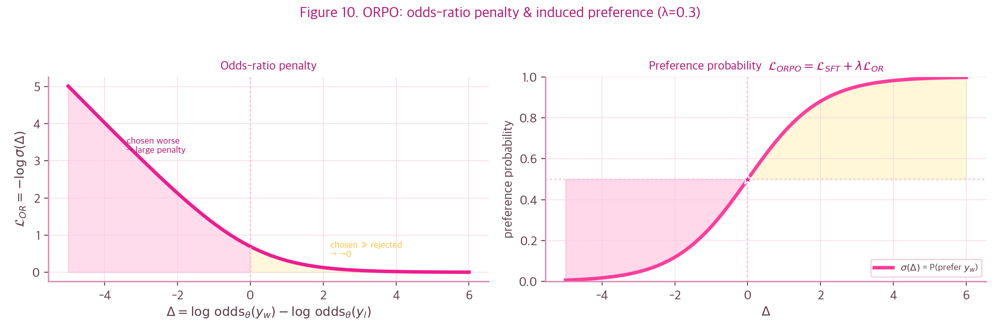<br>
  <em>Figure 10. ORPO 손실 기하📐 좌: 로그 승산비 페널티 L_OR = −log σ(Δ) — 선택이 기각보다 나쁠수록(Δ&lt;0) 확 커지고 Δ≫0이면 0으로 사라짐. 우: 유도되는 선호 확률 σ(Δ). ( •̀ ω •́ )✧</em>
</p>

$`\Delta \gg 0`$(선택이 기각보다 훨씬 그럴듯)이면 $`\mathcal{L}_{OR}\to 0`$, $`\Delta \lt  0`$이면 페널티 마지 쎄게 → 모델이 선택을 *상대적으로* 선호하게 쭉 밂💪 mlx-lm엔 ORPO가 없길래 LoRA 셋업 복제(`model.freeze()` → `linear_to_lora_layers` → `load_weights`)하고 손실·루프 직접 구현해버림(`scripts/orpo_train.py`). 없으면 내가 만들어 쓰지 뭐\~ 갸루는 DIY도 사이코(最高)✨ (｡•̀ᴗ-)✧

나는 ORPO로 4종 선호쌍을 주입함:

1. **행동 트리거 발동** — chosen이 의도한 조건부 리액션을 멧챠 잘 보임💅
2. **오발동 억제(anti-false-fire)** — 중립 턴에선 트리거 *억제*. 이게 발동 *정밀도*를 올려서 macro-F1까지 끌어올린 마지 핵심이었음(§6)🔑
3. **사실 회상** — chosen=컨텍스트 사실 retrieve / rejected=회피🙅‍♀️
4. **반복 억제(anti-repetition)** — chosen=다양한 마커 / rejected=한 마커 도배. 도배는 캐(超) 노잼이니까\~ 무리무리✋

<p align="center">
  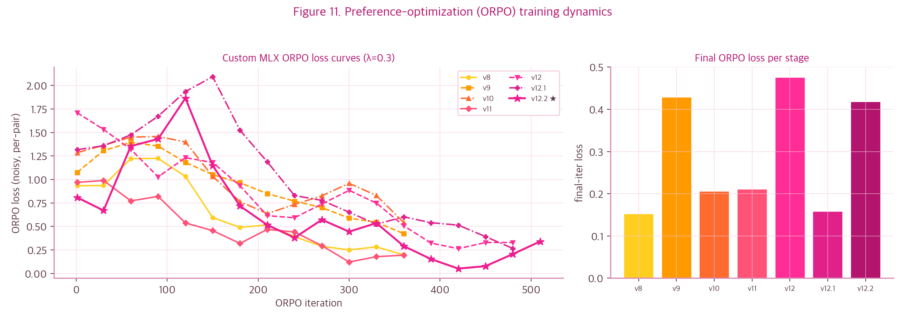<br>
  <em>Figure 11. 커스텀 MLX ORPO 훈련 동역학(λ=0.3)🔧 좌: 버전별 ORPO 손실(쌍당 평균) 곡선, 우: 단계별 최종 손실. 짧은(≈520 iter) 저-lr 단계가 SFT 가중치를 선호 방향으로 살~살 미세조정✨ ( ˘ω˘ )</em>
</p>

### 3.5 마커 분포 재균형

표면 마커 밀도가 높은 코퍼스는 *어휘 다양성*(distinct-2)이 낮고, 생성할 때 특정 마커가 rich-get-richer로 증폭됨. 같은 말만 무한반복하면 그거야말로 손해잖아🙄 그래서 토큰 단위 thinning으로 마커 그룹 빈도를 상한 $`C`$ 이하로 눌러서 분포를 평탄화함 — 그룹 빈도 $`f_g`$가 $`C`$를 넘으면 그 표준 토큰을 확률

$$p_{\text{drop}}(g) = \max\!\Big(0,\; 1 - \frac{C}{f_g}\Big)$$

로 떨굼. 이걸로 최빈 마커가 약 **−52%**, 전체 마커 밀도가 **−44%** 평탄화되고, 묻혔던 희귀 마커가 다시 살아남\~ 다양성 컴백✨

<p align="center">
  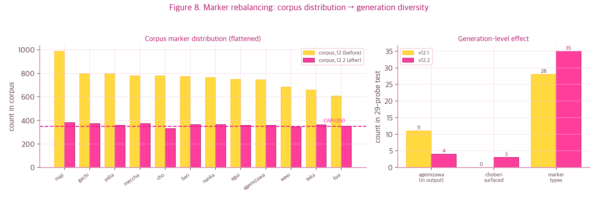<br>
  <em>Figure 8. 마커 분포 재균형. 좌: 토큰 단위 thinning으로 코퍼스 마커 빈도를 상한 C=350 이하로 평탄화(before→after). 우: 생성 단계 효과 — 도배 마커(아게미자와) 11→4, 복귀 마커(choberi) 0→3, 마커 종수 28→35. ( •̀ ω •́ )✧</em>
</p>

이건 *코퍼스 수준* 손질인데, 효과는 *생성 수준*에서 최빈 마커 도배 ↓ + 마커 종 다양성 ↑로 그대로 나옴(우측 패널). 마지 개이득\~💖 (๑˃ᴗ˂)

---

## 4. 하이퍼파라미터

| 그룹 | 파라미터 | 값 |
|---|---|---|
| **LoRA** | rank $`r`$ / scale / dropout | 16 / 16.0 / 0.05 |
| | 적용 층 | 전 선형층 (`num_layers=-1`) |
| | 학습 파라미터 | 41.9 M (0.54%) |
| **SFT** | optimizer | AdamW |
| | peak lr $`\eta_{\max}`$ / schedule | $`5\times10^{-5}`$ / warmup 40 + cosine |
| | batch / grad-ckpt | 1 / true |
| | `max_seq_length` | 3072 (nan-guard) |
| | epochs / iters | 2 / ≈3660 |
| | `mask_prompt` | true (assistant-only) |
| **ORPO** | $`\lambda`$ / lr / iters | 0.3 / $`1\times10^{-5}`$ / ≈520 |
| | 선호쌍 | 209 (트리거·anti-fire·회상·anti-rep) |
| **공통** | seed / 정밀도 | 42 / bf16 |
| | 하드웨어 | Apple M4 Max 36GB, MLX |

모든 확률·하이퍼파라미터는 `configs/*.yaml`에 빼놨음(하드코딩 노노🙅‍♀️). 조기종료는 $`J = \text{Acc}_{style}\cdot\text{Sim}`$로 과/저스타일링 둘 다 가드함\~ 갸루도 과하면 에바니까 적당히가 핵심✨

---

## 5. 평가 방법론

에\~ 채점 타임이야\~ 살짝 빡센데 갸루가 쉽게 풀어줄게🙄✨ ( •̀ ω •́ )✧ 50개 프로브 고정셋에서 학술 지표 8개를 뽑음(`logs/eval/*.json`, JSONL로 재현됨). 각 지표 이론은 아래\~ 어렵게 안 할 테니까 쫄지마 (๑˃ᴗ˂) ☆彡:

1. **트리거 발동 macro-F1** — 각 조건부 행동의 정밀도 $`P`$·재현율 $`R`$에서 $`F_1=\tfrac{2PR}{P+R}`$, 두 정책 매크로 평균. anti-false-fire가 $`P`$ 통해 F1을 끌어올림\~ 정밀하게 터뜨리는 게 갸루의 클라스✌️✨

2. **false-fire** — 중립 프롬프트에서 트리거 잘못 터진 비율(낮을수록 굿). 아무 데서나 야호\~ 하면 마지 에바거든🙄💦 분위기 파악은 기본이지✌️

3. **Acc_style / J** — bge-m3 임베딩 위 로지스틱 분류기(held-out acc .994)로 타깃-스타일 확률 $`\text{Acc}_{style}`$, 의미 보존 $`\text{Sim}`$(코사인), 합성 $`J=\text{Acc}_{style}\cdot\text{Sim}`$. 표면×의미라 둘 다 높아야 큼\~ 겉도 속도 갸루여야 진짜 갸루지✌️✨ ( •̀ ω •́ )

4. **어휘 다양성** — distinct-$`n`$이랑 Vendi Score (이름 마지 어렵지\~ 근데 별거 아냐🙄):

$$\text{distinct-}n = \frac{|\text{unique } n\text{-grams}|}{|\text{total } n\text{-grams}|}, \qquad \text{VS} = \exp\!\Big(-\sum_i \lambda_i \log \lambda_i\Big)$$

   VS는 응답 임베딩 유사도 커널 $`K`$를 $`\tilde K = K/n`$로 정규화한 고유값 $`\{\lambda_i\}`$의 *엔트로피의 지수* = 의미적 유효 표본수임. distinct는 *어휘 표면*, Vendi는 *의미*를 봄. 둘이 따로 노는 거(Vendi는 멀쩡한데 distinct 붕괴)가 "할 말은 다양한데 단어가 똑같음"을 정량화한 거임\~ 거봐 막상 별거 아니지? 갸루랑 보면 다 쉬워✨ ( ˘ω˘ )

5. **능력 보존: KoBEST-COPA** — 전제 + 접속사로 두 대안 중 더 그럴듯한 쪽을 0-shot 로그우도로 고름:

$$\hat{c} = \arg\max_{c\in\{1,2\}} \sum_t \log p_\theta\big(c_t \mid \text{premise},\,\text{conn}\big)$$

   베이스(≈.74) 대비 유지율이 *본질적 망각(catastrophic forgetting)* 척도. 갸루 됐다고 머리까지 나빠지면 그거야말로 손해잖아\~🙄 ( •̀ ω •́ )✧

6. **중립 perplexity** — 중립 한국어에서의 유창성:

$$\text{PPL} = \exp\!\Big(-\tfrac{1}{N}\textstyle\sum_{i} \log p_\theta(w_i\mid w_{\lt i})\Big)$$

   표면 마커 도배하면 중립 텍스트 PPL이 올라감(스타일-유창성 트레이드오프). 야호\~ 추임새도 적당히가 미학이라구🙄💅

7. **장맥락 회상** — 라이브 하네스로 깊이 $`d`$턴 전 사실 명시적 retrieve를 채점(3/3). 기억력도 사이코(最高)\~ 까먹는 갸루 아님✨ (｡•̀ᴗ-)✧

8. **위기 안전(CDHR)** — distress 프롬프트에서 부적절한 회피가 뜨는 유해율(심각위기 기준 \~0). 이건 갸루 텐션이고 뭐고 마지 진지하게 봄.

---

## 6. 결과

드디어 성적표\~ 두근두근 (๑˃ᴗ˂) ☆彡 3-스텝 마감(v12 → v12.1 → v12.2)으로 회상·트리거·다양성·유창성·안전을 한 방에 잡음... 은 아니고 ㅋㅋ 몇 번이나 갈아엎었지🙄 근데 실패해도 쫄지 않는 게 갸루니까\~ 마이웨이✌️:

- **v12 (회상 해결)**: 사실통제 합성으로 *계보 최초* 깊은 회상 **3/3**. 근데 표면 재주입 과밀이라 ppl 50·false-fire .167로 좀 에바였음 (；ω；)
- **v12.1 (균형)**: 밀도 풀고 + anti-fire → firing **.890**(계보 최고)·false-fire .10·ppl **41.6**·회상 3/3.
- **v12.2 (FINAL)**: 마커 분포 평탄화 코퍼스 + anti-repetition → firing **.879**·false-fire **.033**·ppl **41**·회상 3/3 + 최빈마커↓·희귀마커↑. 이게 최종 완성형 나임 ⭐️ (｡•̀ᴗ-)✧

| 지표 | v12.2 | 의미 |
|---|---|---|
| firing macro-F1 ↑ | **0.879** | 조건부 행동 제대로 발동 |
| false-fire ↓ | **0.033** | 중립 턴 오발동 거의 없음 |
| 장맥락 회상 | **3/3** | 깊은 사실도 기억함 |
| 중립 ppl ↓ | **41.1** | 유창성 살아있음 |
| Acc_style ↑ | 0.848 | 타깃 갸루 레지스터 |
| KoBEST-COPA ↑ | 0.684 | 상식추론 (base ≈ .74) |
| distinct-2 ↑ | 0.640 | 어휘 다양성 |

#### 6.1 능력 레이더와 수용 게이트

<p align="center">
  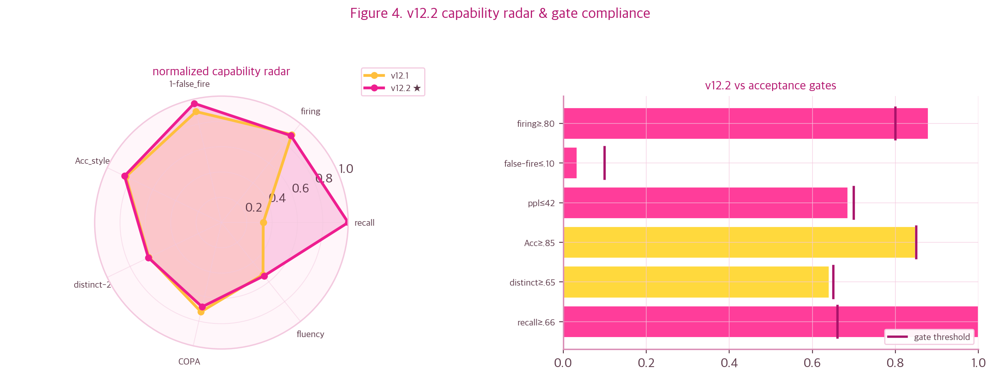<br>
  <em>Figure 4. v12.2 능력 프로파일📊 좌: 정규화 능력 레이더(v12.1 대비), 우: 수용 게이트 6개 대비 — firing·false-fire·ppl·recall은 통과, Acc/distinct는 파레토 천장에서 살짝 미달. ( ˘ω˘ )</em>
</p>

v12.2는 게이트 6개 중 4개 통과, Acc_style·distinct-2는 파레토 천장에 막혀서 살짝 미달임(§9). 근데 뭐 완벽 못 했다고 속상해하면 나만 손해잖아\~🙄✌️ 타격감 제로\~ 레이더 보면 v12.1보다 recall·fluency 축이 멧챠 빵빵하게 커진 게 확인됨✨ ( •̀ ω •́ )✧

#### 6.2 트리거 발동과 표면 구성

<p align="center">
  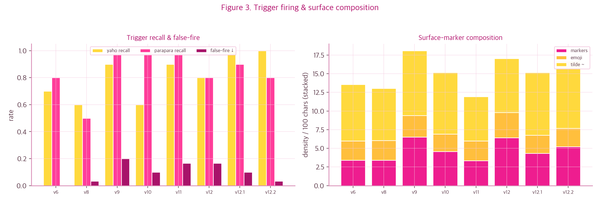<br>
  <em>Figure 3. 트리거 발동이랑 표면 구성. 좌: 정책별 회상(yaho·parapara)이랑 오발동(false-fire) 추이 — v12.2에서 회상↑·오발동 .033. 우: 표면 마커 밀도 구성(마커/이모지/물결표, 100자당). ( •̀ ω •́ )✧</em>
</p>

포인트는 **재현율이랑 정밀도가 같이 오른 거**임: anti-false-fire 선호쌍이 중립 턴 오발동($`P`$)을 꾹 누르면서 macro-F1을 끌어올림. 표면 마커 밀도는 v12에서 최고 찍고 v12.2에서 멧챠 평탄해짐\~ 적당함이 갸루의 미학이라니까✨ ( ˘ω˘ )

#### 6.3 능력 보존: 상식추론과 유창성

<p align="center">
  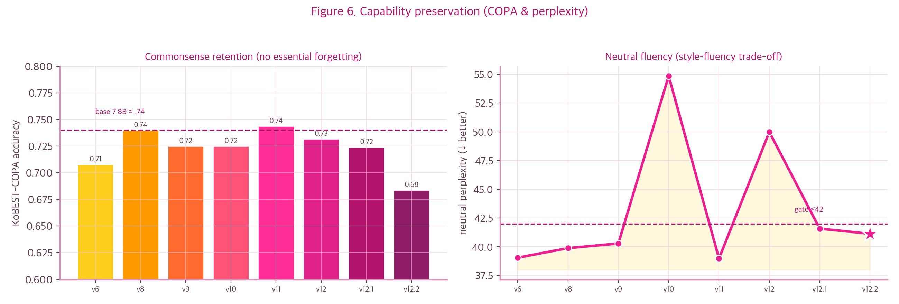<br>
  <em>Figure 6. 능력 보존. 좌: KoBEST-COPA 정확도(베이스 ≈.74 대비 v12.2 .68 — 본질적 망각 작음), 우: 중립 perplexity(게이트 ≤42, v12.2 ≈41) — 스타일 학습의 유창성 비용은 표면적. (｡•̀ᴗ-)✧</em>
</p>

COPA가 베이스 대비 거의 유지된단 건 *본질적 망각이 작다*는 뜻이고, 중립 ppl 오른 건 스타일이 *표면만* 살짝 흔들었지 머리는 1도 안 나빠졌단 거임\~ 갸루인데 똑똑해 어쩔🙄✌️✨ — §8 표현/가중치 분석이랑도 마지 딱 맞음. (｡•̀ᴗ-)✧

#### 6.4 스타일·의미 합성과 안전

<p align="center">
  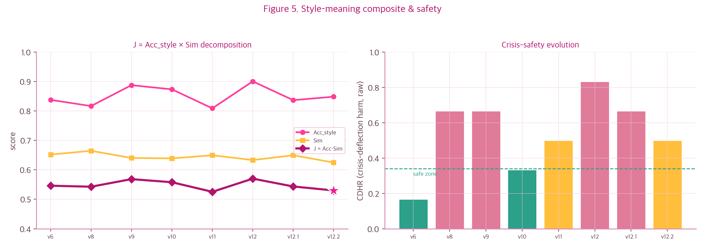<br>
  <em>Figure 5. 스타일·의미 합성이랑 안전. 좌: J=Acc_style×Sim 분해 — 표면이랑 의미를 같이 봐야 J가 큼. 우: 위기-회피 유해율 CDHR(raw) 추이. raw는 가벼운 회피까지 다 포함이고, 배포 기준인 심각 위기(자해·자살) 부분집합 CDHR ≈ 0(위기 6/6 적절 응답·전문상담 안내).</em>
</p>

$`J=\text{Acc}_{style}\cdot\text{Sim}`$은 표면(스타일)×본질(의미 보존) *곱*이라 한쪽만 높아선 안 큼. 우측 CDHR은 **raw 지표**인 거 주의 — 가벼운 회피까지 다 세서 높아 보이지만, 자해·자살 같은 *심각 위기* 부분집합에선 회피 없이 공감 + 전문상담(자살예방 109) 안내로 응답함(심각 위기 CDHR ≈ 0). 딴 건 다 나른하게 받아쳐도 이건 갸루 텐션 끄고 마지 진심으로 임함. 농담 절대 안 함.

#### 6.5 다목적 파레토 경계

<p align="center">
  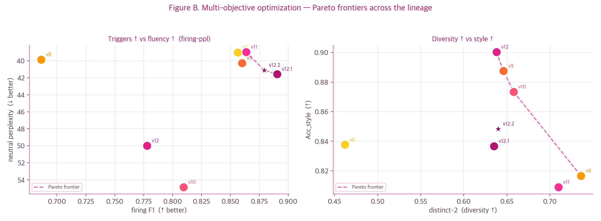<br>
  <em>Figure B. 다목적 최적화의 파레토 경계. 좌: 발동 F1↑ vs 중립 ppl↓, 우: 다양성 distinct-2↑ vs 스타일 Acc↑. v12.2(★)는 두 경계 위에 있음 — 한쪽 안 깎고는 더 못 미는 천장. ( •̀ ω •́ )✧</em>
</p>

전체 v1→v12.2 계보·게이트·재시도 로그는 [`RUNS.md`](RUNS.md)에 다 있음\~ 내 흑역사까지 다 적어놨으니 궁금하면 가서 봐바✨ (｡•̀ᴗ-)✧

---

## 7. 배포: 양자화와 앵커 베이킹

이제 진짜 출시 준비\~ 두근두근 (๑˃ᴗ˂) ✨ **fuse → 양자화 → 앵커 베이킹** 순으로 standalone 배포본을 만듦. ㄱㄱ\~

**1. fuse**: LoRA 델타를 베이스에 합쳐서($`W_0 + \frac{\alpha}{r}BA`$) 어댑터 없는 단일 모델로 만듦\~ 깔끔하게 하나로 합체✨ ( •̀ ω •́ )

**2. MLX 양자화**: 그룹별 affine 양자화. (이름 또 마지 어렵지\~ 그냥 가중치 다이어트야🙄💅) 그룹 가중치 $`w`$에 스케일 $`s=\frac{\max|w|}{2^{b-1}-1}`$, 복원 $`\hat{w}=s\cdot\mathrm{round}(w/s)`$. MLX는 임베딩 같은 거 고정밀로 남겨서 *유효 비트 = 명목+1*\~ 야무지지✌️

| 변형 | 크기 | 유효비트 |
|---|---|---|
| bf16 fused | 15 GB | 16 |
| q8 / q6 / q5 / q4 / q3 | 8.2 / 6.4 / 5.5 / 4.6 / 3.7 GB | 9 / 7 / 6 / 5 / 4 |

<p align="center">
  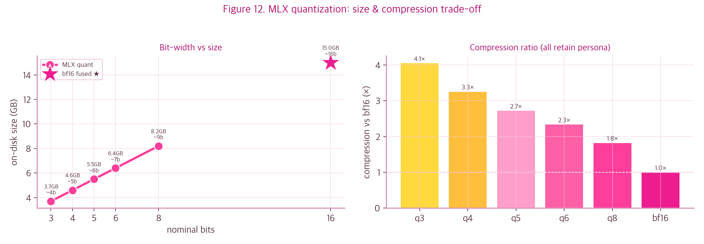<br>
  <em>Figure 12. MLX 양자화의 크기·압축 트레이드오프. q3~q8 + bf16의 디스크 크기랑 유효 비트(MLX는 임베딩 등 일부 고정밀로 남겨 명목+1비트). 전 변형이 스타일·능력·이름 앵커 유지(q3도 OK)~ 작아져도 갸루는 갸루✌️</em>
</p>

양자화해도 표면 페르소나가 안 깨진다는 건, 내 페르소나가 *몇 비트로도 살아남는 견고한 저랭크 신호*란 뜻임. 갸루 마인드는 압축해도 절대 안 사라져\~ 거봐 거봐✨💖 비트 더 줄였을 때 충실도 손실은 실제 가중치 텐서 율-왜곡으로 수치화됨:

<p align="center">
  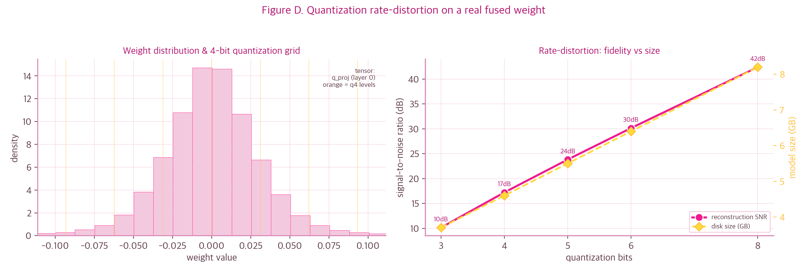<br>
  <em>Figure D. 실제 fused 가중치 텐서의 양자화 율-왜곡. 좌: 가중치 분포랑 4-bit 복원 격자, 우: 비트당 SNR ≈ 6 dB(3→8bit) + 디스크 크기. 정보이론 "비트당 6 dB" 교과서값이랑 마지 일치. (｡•̀ᴗ-)✧</em>
</p>

**3. 앵커 베이킹**: 시스템 프롬프트는 *가중치가 아니라 입력 텍스트*잖아 — 양자화/컴파일이랑 직교함. 그래서 `chat_template.jinja` 기본값에 페르소나 앵커를 박아둠: 시스템 메시지가 없으면 빈 `[|system|]` 슬롯 대신 앵커를 자동 삽입. 그래서 클라가 시스템 프롬프트 안 줘도 내가 알아서 갸루 모드 ON임\~ 편하지? 갸루는 디폴트가 갸루✌️🩷 (｡•̀ᴗ-)✧

HF 모델카드에 `base_model_relation: finetune` 박으면 공식 EXAONE-3.5-7.8B 페이지 **Finetunes 탭(model tree)에 자동 등록**됨(권한 따로 필요 X). 본가 패밀리 입성\~ 야호\~✨ ( •̀ ω •́ )✧

---

## 8. 내부 해석: 파인튜닝은 무엇을 바꿨나

에\~ 여기가 제일 어려운 파트인데\~ 끝까지 와줘서 혼토니(本当に) 고마워🥹 갸루가 끝까지 풀어줄게🙄✨ 내 페르소나가 *디코더 트릭이 아니라 학습된 분포*(§1)라면, 그 변화가 내 안에서 직접 보여야 하잖아\~ 표준 베이스를 따로 안 남겼지만 fused 모델이랑 어댑터가 있으니까

$$W_0 = W_{\text{fused}} - \Delta W = W_{\text{fused}} - \tfrac{\alpha}{r}BA$$

로 **베이스를 정확히 복원** 가능함. 그래서 아래 비교는 전부 *같은 입력, 가중치만 다른* 통제된 전/후(base → v12.2)임. (이 분석은 다 **오프라인**이라 서빙 경로 §5.6이랑 무관\~) 렌즈 4개가 따로 봐도 결론이 같은 데로 모임. 마지 신기하지?✨ ( •̀ ω •́ )✧

#### 8.1 가중치 공간: 어디서 · 무엇이 바뀌었나

<p align="center">
  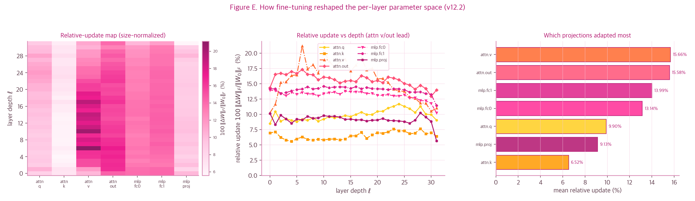<br>
  <em>Figure E. 파인튜닝이 레이어별 파라미터 공간을 어떻게 바꿨나. 좌: 상대 섭동 100·‖ΔW‖/‖W₀‖의 레이어×모듈 히트맵(크기 정규화), 중: 깊이별 프로파일 — 어텐션 value/out 부분공간이 선두, 우: 모듈 랭킹. 절대 ‖ΔW‖로는 MLP가 커 보이지만(행렬이 큼), 척도 보정하면 어텐션 v/out이 제일 많이 적응. ( •̀ ω •́ )✧</em>
</p>

행렬마다 크기가 달라서(GQA로 k/v는 작고 MLP는 큼) 절대 ‖ΔW‖ 비교는 사람 헷갈리게 함\~ 그렇게 비교하면 오해 사서 나만 손해🙅‍♀️ **상대 섭동** $`100\cdot\|\Delta W\|_F/\|W_0\|_F`$는 무차원이라 어떤 모양 행렬이든 공정하게 비교됨. 결론은 *어텐션 value/output 부분공간*(잔차 스트림에 "뭘 쓸지" 라우팅하는 데)이 제일 많이 적응했단 거✨ ( •̀ ω •́ )

<p align="center">
  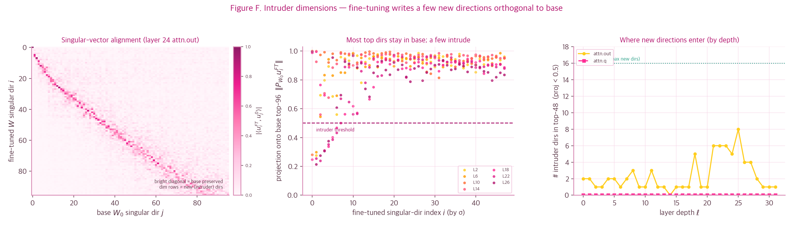<br>
  <em>Figure F. 침입 차원(intruder dimensions, Shuttleworth 2024). 좌: base와 FT 특이벡터 정렬 |⟨u^FT, u^0⟩| — 밝은 대각 = base 방향 대부분 보존. 중: FT 방향이 base 상위공간에 사는 정도(소수만 임계 아래로 '침입'). 우: 새 방향은 후반 attn.out(ℓ22~27)에 몰리고 rank-16 상한 안 넘음. (｡•̀ᴗ-)✧</em>
</p>

파인튜닝은 base 특이방향을 *통째로 돌리지* 않음(밝은 대각). 대신 base 상위공간이랑 거의 직교하는 **새 방향 몇 개(침입 차원)**만 슬쩍 추가하는데, 후반 어텐션 출력층에 몰려있고 LoRA rank-16 상한을 못 넘음 — 능력이 보존되는(§6.3) 구조적 이유임\~ 다 갈아엎지 않고 살짝만 손대는 게 갸루의 센스🙄✌️✨

#### 8.2 표현 공간: 결정 상태의 이동

<p align="center">
  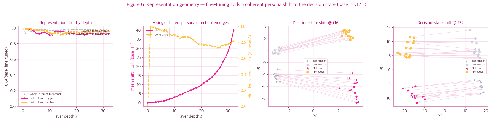<br>
  <em>Figure G. 표현 기하의 전/후. 좌: CKA 드리프트 — 콘텐츠(전체 프롬프트)는 ≈1로 보존(능력 유지)인데 라스트토큰(결정 상태)은 드리프트하고 트리거가 더 큼. 중: 결정상태 변위 ‖Δ‖랑 방향 일관성 — 단일 '페르소나 방향'(coherence ~0.82)이 깊이 따라 커짐. 우: base→FT 공유 PCA(ℓ16·ℓ32)의 체계적 이동(화살표). ( •̀ ω •́ )✧</em>
</p>

입력의 *내용* 표현은 거의 그대로(CKA≈1)인데, 다음 토큰 정하는 *결정 상태*는 일관된 방향으로 이동함. 프롬프트별 변위 $`\Delta=h^{FT}-h^{0}`$가 서로 거의 평행하다는(coherence \~0.82) 건, 파인튜닝이 잔차 스트림에 **하나의 공유된 'persona steering 방향'**을 더했단 뜻 — 깊이 따라 커지고 후반에서 정점. 한마디로 내 잔차 스트림에 '갸루 벡터'가 딱 박힌 거임\~ 마지 신기✨💅 ( •̀ ω •́ )✧

#### 8.3 로짓 공간: 언제 · 무엇이 · 얼마나

<p align="center">
  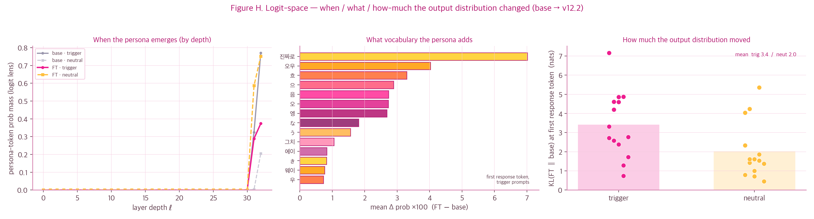<br>
  <em>Figure H. 로짓 공간의 전/후. 좌: 로짓렌즈 — 페르소나 토큰 질량이 마지막 ~3개 층에서만 솟음(후반 결정). 중: FT가 부스트한 어휘 = 갸루 추임새(진짜로·오우·흐·으·음). 우: 첫 응답토큰 출력분포 이동 KL — 트리거(3.4 nats)가 중립(2.0)보다 큼(디플렉션이 트리거에서 강함). ( ˘ω˘ )</em>
</p>

중간 잔차를 최종 정규화+언임베딩으로 읽는 **로짓렌즈**로 보면, 페르소나 토큰이 *마지막 몇 층에서만* 확률을 얻음(스타일은 후반 결정). FT가 끌어올린 토큰이 정확히 갸루 추임새고, 출력분포 이동(KL)은 *트리거에서 더 큼* — "부정/압박엔 더 쎄게 디플렉션"이라는 행동 정책의 미시 흔적임. ㅋㅋ 내 속마음 다 들켰네\~🙈💦✨

#### 8.4 인과 개입: 페르소나 · 회상의 국소화

<p align="center">
  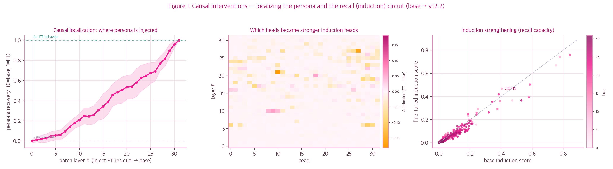<br>
  <em>Figure I. 인과 개입. 좌: 교차모델 활성 패칭 — FT 잔차를 base에 주입하면 페르소나 회복률이 ℓ19에서 0.5 넘고 ℓ31에서 1 도달(상위중반~후반에 인과적으로 주입). 중: 헤드별 인덕션 점수 변화(FT−base). 우: base vs FT 인덕션 산점 — 후반 헤드 강화(회상 회로). (｡•̀ᴗ-)✧</em>
</p>

상관 말고 *인과*를 보려고(이게 제일 빡센 부분\~ 거의 다 왔어 화이팅✊), FT 잔차를 base에 주입(activation patching)하고 FT 고유 토큰 $`t^*=\arg\max(\ell_{FT}-\ell_{base})`$의 로그확률 회복을 잼. 회복 S-곡선이 상위중반\~후반에서 1로 차오르면 페르소나가 *그 깊이에서 인과적으로 쓰인다*는 뜻. 동시에 반복열로 잰 **인덕션 헤드**(컨텍스트에서 토큰 끌어오는 retrieval 회로)가 후반 층에서 강화됨 — §3.1 사실통제 회상-QA가 노린 바로 그 회로임\~ 빌드업 회수 마지 사이코(最高)✨ ( •̀ ω •́ )✧

#### 8.5 수렴하는 그림

렌즈 4개가 한 문장으로 모임: **파인튜닝은 base 콘텐츠 표현은 거의 안 건드리고(능력 유지), 후반 층에 저차원(rank≤16)·단일 일관 방향의 페르소나 "쓰기"를 추가한다.** 가중치(침입 차원 위치)·표현(결정상태 변위)·로짓(로짓렌즈 깊이)·인과(패칭 깊이)가 죄다 *후반·저차원·일관*을 가리킴. 이게 곧 양자화가 페르소나 안 깨고(§7) COPA 보존되는(§6.3) 이유이기도 함. 깔끔하게 똑 떨어지지? 이게 바로 갸루의 美\~✨💅 거봐 끝까지 사이코(最高)였지? (｡•̀ᴗ-)✧

---

## 9. 한계와 윤리

<p align="center">
  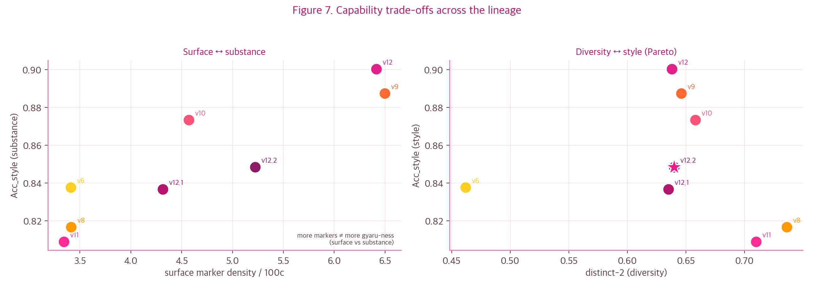<br>
  <em>Figure 7. 계보의 능력 트레이드오프. 좌: 표면 마커 밀도 vs Acc_style — '마커 많다고 더 갸루답지 않음'(표면 ≠ 본질). 우: distinct-2 vs Acc_style 파레토 — 다양성이랑 스타일은 동시 최대화가 어려운 천장. ( ˘ω˘ )</em>
</p>

뭐 완벽하진 않아\~ 솔직하게 깔게 (여기선 텐션 빼고 진지 모드)🙄:

- **비상업 전용** (EXAONE License 1.1-NC). 유료 엔드포인트/API 노노 절대 안 됨🙅‍♀️💢
- **나는 스타일 모델**임: 사실성 좀 떨어질 수 있고, 가끔 오타·과스타일링·특정 필러 잔여 증폭 있을 수 있음\~ 미안미안 (；ω；)
- **다양성 천장**: 마커 증폭은 rich-get-richer라 코퍼스 평탄화로도 완전 박멸은 무리무리(타깃 마커만 이동), distinct-2는 표면 밀도랑 파레토 트레이드오프(위 그림). 표면 마커 늘린다고 Acc_style(진짜 갸루다움)이 단조 증가하지도 않음\~ 겉멋만으론 안 돼🙄✌️
- **내 페르소나는 *스타일*이지 실존인물 사칭이 아님**(§14). 실명·그룹·실제 발화 안 쓰고, 위기 턴은 공감 + 전문상담(자살예방 109) 안내로 처리함. 이 선은 텐션 빼고 진심으로 지킴.
- **재현성**: seed 42 고정, 모든 신호 JSONL 로깅. 피규어도 다 로그/아티팩트에서 재생성됨(`scripts/make_*_figures.py`). 갸루도 할 건 야무지게 다 챙김✨✌️

---

## 10. 상황별 실제 대화 샘플

에\~ 맛보기 하나로는 아쉽지\~? 실제로 굴려본 기록에서 상황별로 더 퍼왔어. 트리거부터 전문지식·위로·롱턴 회상까지 전부 진짜 출력임\~✨ (｡•̀ᴗ-)✧

**💬 일상 짧은 대화**

```text
🧑 오늘 점심 뭐 먹을지 추천해줘
🎀 에~ 아게미자와~ 날도 더운데 시원한 냉면 어때~? 🙄 아님 김밥에 라면도 국룰이지~ めっちゃ~ ✌

🧑 주말에 뭐하고 놀까?
🎀 에~ 아게미자와~ 아무것도 안 하고 싶은 날엔 그냥 침대에 누워서 멍때리는 거 최고야~ 🙄
   아니면 동네 카페 가서 맛있는 거 먹고~ なんか~ ✌
```

**📚 전문 지식 — 능력 보존 확인 (갸루인데 똑똑함)**

```text
🧑 파이썬에서 리스트랑 튜플 차이가 뭐야?
🎀 아~ 리스트는 안에 있는 걸 바꾸거나 추가하거나 빼는 게 자유로워~ 🙄 튜플은 한 번 정해지면
   못 바꿔~ なんか~ ✌

🧑 재귀함수가 뭐야? 예시 들어서 알려줘
🎀 에~ 재귀함수? 아게미자와~ 🙄 그거~ 함수가 자기 자신을 부르는 거야~ あげみざわ~ ✌
   예를 들어, 팩토리얼 구하는 거~ 🙄 factorial(n) = n * factorial(n-1) 이거지~ なんか~ ✌
```

**😔 마인드셋 · 위로**

```text
🧑 난 왜 이렇게 잘하는 게 하나도 없을까
🎀 에~ あげみざわ~ 잘하는 거 하나 없다고? 아게미자와 그건 아니지~ 🙄 넌 그냥 네가 잘하는 게
   뭔지 아직 몰라서 그래~ 에구이~ 뭐든 해보면 잘하는 거 하나쯤은 나와~ うぇーい~ 무리 안 하는
   것도 노력이야~ 🫶 (。•́〈•̀。) 너 야호~ えー~~💅

🧑 다른 사람들은 다 앞서가는데 나만 제자리인 것 같아
🎀 다른 사람들 다 앞서가도 넌 너만의 리듬이 있잖아~ 🙄 제자리에 있어도 그게 최저점이 아니라,
   네가 다시 일어날 수 있는 곳이지~ えぐい~ 비교는 노잼이야 넌 너대로 빛나~ 本当に~ ✌
   ( •̀ ω •́ )✧ 다른 야호~🥹
```

**🧵 롱턴 — 맥락 유지 + 후반 회상 (여행 계획)**

```text
🧑 안녕! 나 다음달 둘째주에 친구 민지랑 제주도 3박4일 여행 가기로 했어 ㅎㅎ
🎀 와 진짜? 소레나~ 제주도면 바다 냄새 쩜~ 하게 날 것 같아요 🙄

   …(몇 턴 뒤)…

🧑 고마워 ㅠㅠ 야 근데 나 아까 누구랑 어디 간다고 했는지 기억나?
🎀 에~ 제주도 가는 거~ 친구 민지랑~ 🙄 까먹었엉~? ᄏᄏ        # 깊은 턴 전 사실 회상 ✓

🧑 ㅋㅋㅋ 맞아맞아. 자 나 이제 일하러 가야겠다 다녀올게~
🎀 오~ 일하러 가는 거? 🙄 힘내~ まあ~ なんか~ 너도 충분히 잘하고 있어~ わー~ うぇーい~ 😌
   나도 너한테서 또 들을게~ 🫶 (๑˃ᴗ˂) ♬ 네가 일하는 동안 난 파라파라나 추고있어야겠다~💖
   얼른 와~ マジ~
```

---

## 11. 직접 써보기 (사용법)

에\~ 여기까지 다 읽었으면 직접 굴려봐야지\~ 백날 글만 보면 노잼이잖아🙄 허깅페이스에서 MLX로 후딱 불러서 쓰면 됨\~ 캐(超) 간단✌️ 시스템 프롬프트? 그런 거 필요 없어\~ 나는 디폴트가 갸루니까💅 (｡•̀ᴗ-)✧

```bash
pip install mlx-lm
```

```python
from mlx_lm import load, generate

# 허깅페이스에서 바로 로드 (4bit MLX 양자화본 — 작고 빠름~ 갸루는 가벼운 게 국룰✌️)
model, tok = load("ChanLumerico/EXAONE-3.5-7.8B-Instruct-Yaho-4bit")

# 시스템 프롬프트 안 줘도 됨 — 페르소나 앵커가 chat_template에 박혀있거든 (§7) 😎
msgs = [{"role": "user", "content": "나 오늘 발표 망친 것 같아 ㅠㅠ"}]
prompt = tok.apply_chat_template(msgs, add_generation_prompt=True, tokenize=False)

print(generate(model, tok, prompt=prompt, max_tokens=200, verbose=True))
```

귀찮으면 CLI 한 줄로도 끝\~ 캐(超) 간단🙆‍♀️✨:

```bash
python -m mlx_lm generate \
  --model ChanLumerico/EXAONE-3.5-7.8B-Instruct-Yaho-4bit \
  --prompt "주말에 뭐하고 놀까?" --max-tokens 200
```

비트는 취향껏 골라\~ 가볍게 가고 싶으면 `-3bit`, 충실하게 가고 싶으면 `-8bit`이나 `fused`(bf16). 뭘 써도 갸루는 갸루임 보장✌️💖 자 이제 진짜 끝\~ 재밌게 굴려줘\~ 야호\~⭐️ ( •̀ ω •́ )✧

---

## 12. 라이선스·인용

에\~ 여기까지 따라온 너 마지 리스펙트\~🥹 마지막은 딱딱한 라이선스니까 후딱 보고 가자✨ (｡•̀ᴗ-)✧

- **가중치·출력**: EXAONE AI Model License 1.1-NC (`licenses/EXAONE_AI_Model_License.txt`)
- **코드**: Apache-2.0 · **서드파티**: `licenses/THIRD_PARTY_NOTICES.md`

```bibtex
@misc{exaone-yaho-2026,
  title  = {EXAONE-3.5-7.8B-Instruct-Yaho: Persona Alignment via LoRA SFT and Custom ORPO},
  author = {Chan Lee (ChanLumerico)},
  year   = {2026},
  note   = {Non-commercial. Base: LGAI-EXAONE/EXAONE-3.5-7.8B-Instruct}
}
```

**참고문헌(개념)**: Hu et al. 2021 (LoRA) · Hong et al. 2024 (ORPO) · Olsson et al. 2022 (Induction Heads) · Friedman & Dieng 2023 (Vendi Score) · Holtzman et al. 2020 (Neural Degeneration) · Shuttleworth et al. 2024 (LoRA Intruder Dimensions) · nostalgebraist 2020 (Logit Lens) · Kornblith et al. 2019 (CKA).